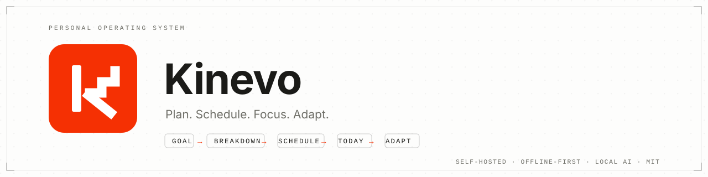

<div align="center">

<picture>
  <source media="(prefers-color-scheme: dark)" srcset="docs/assets/banner-kinevo-dark.svg">
  
</picture>

[](https://github.com/sedam-or/Kinevo/actions/workflows/ci.yml)
[](LICENSE)
[](server/composer.json)
[](server/composer.json)
[](server/package.json)
[](infrastructure/docker-compose.yml)
[](CONTRIBUTING.md)

**A personal operating system you actually own.**
Goals in, chaos out: Kinevo turns long-horizon goals into scheduled, executable
work — with a deterministic scheduling core, offline-first PWA shell, and
optional local AI that never owns your schedule.

`GOAL → BREAKDOWN → MILESTONE → TASK → SCHEDULE → TODAY → FOCUS → PROGRESS → ADAPT`

</div>

---

## Why Kinevo

Most productivity tools rent you your own workflow. Kinevo is the opposite:
a **single-user, self-hosted** system where the schedule is deterministic, the
data lives in your PostgreSQL, and AI — if you enable it at all — is an
untrusted assistant that proposes and validates, never decides.

- **Deterministic scheduling engine** — same inputs, same plan, every time. No
  black-box reordering of your day; the schedule is explainable and testable.
- **Offline that respects the server** — a durable IndexedDB mutation queue
  (operation UUIDs) reconciles through a server-side operation ledger with
  idempotent replay and optimistic conflict handling — never last-write-wins —
  so you keep working on a plane, on a train, or on a bad connection.
- **AI that knows its place** — optional local (Ollama) or remote providers
  break down goals into reviewable milestones. Schema-validated, domain-checked,
  human-approved before anything is applied.
- **One coherent workflow** — goals, milestones, programs, tasks, hard
  landscape commitments, knowledge notes, canvas boards, capacity analytics,
  and recovery are one connected system, not separate apps.
- **A reference architecture worth reading** — a disciplined Laravel modular
  monolith (domain → application → infrastructure), Vue 3 + TypeScript SPA,
  contract-first API, and ADR-recorded decisions.

## What you get

| Area | Highlights |
| --- | --- |
| Planning | Goals, milestones, programs; inline AI breakdown proposals you edit and accept |
| Execution | Today surface with a now-next spotlight, focus sessions, boosts, recovery |
| Scheduling | Draft generation, dynamic reschedule, hard-landscape calendar constraints |
| Knowledge | Notes with Tiptap, links, attachments, and Excalidraw canvas boards |
| Analytics | Work-life ratio, capacity realization, goal pressure — each chart routes to an action |
| Resilience | Offline queue + sync, end-of-day reconciliation, morning recovery of missed work |
| Operations | Docker deployment, backups/restore, health checks, versioned API contract |

## Quick start

Requires Docker and Make.

```bash
git clone https://github.com/sedam-or/Kinevo.git
cd Kinevo
make up          # build + start app (PHP-FPM) and PostgreSQL
make migrate     # run migrations
```

Open <http://localhost:8000> and register — the first account becomes the
owner. Daily development commands:

```bash
make test        # PHPUnit suite (in-memory SQLite — cannot touch your data)
make lint        # Pint style check
make analyse     # PHPStan static analysis
make validate    # repository baseline validation
make down        # stop services
```

Production deployment (Docker Compose, backups, restore) is documented in
[`docs/deployment.md`](docs/deployment.md).

## How it fits together

```text
Browser / PWA
    ├── Vue 3 + TypeScript SPA · Pinia · Service Worker · IndexedDB
    ▼
Laravel Modular Monolith
    ├── Planning / Goals / Milestones / Programs
    ├── Tasks / Execution / Recovery
    ├── Scheduling Engine (deterministic)
    ├── Knowledge / Notes / Canvas
    ├── Capacity / Analytics
    ├── Offline Sync (queue + reconciliation)
    └── AI Orchestrator (optional, untrusted, validated)
          │
          ├── PostgreSQL     (canonical store)
          ├── Object Storage (attachments)
          └── Ollama / AI provider (optional)
```

External engines stay behind bounded adapters: **Excalidraw owns drawing,
Tiptap owns editing, Ollama owns inference — Kinevo owns business semantics.**

## Engineering discipline

This repository treats quality gates as part of the product, not an afterthought:

- **1,125 backend tests** (3,944 assertions) — domain, application, and API suites
- **531 frontend unit tests** across 75 files (Vitest)
- **Real-browser Playwright matrix** — Chromium, Firefox, and WebKit, including
  golden journeys, effective-schedule journeys, scheduler lifecycle, offline
  reconciliation, accessibility (axe WCAG 2.2 A/AA), and mobile width sweeps
- **PHPStan** static analysis and **Pint** style gates in CI
- Contract-first: versioned OpenAPI, migration discipline, optimistic
  concurrency with stable `409` conflicts

## Technology stack

| Layer | Choice |
| --- | --- |
| Backend | PHP 8.4 · Laravel (modular monolith) |
| Frontend | Vue 3 · TypeScript · Vite · Pinia (SPA) |
| Database | PostgreSQL 17 |
| Rich text | Tiptap (behind a Kinevo editor adapter) |
| Canvas | Excalidraw (behind a bounded integration adapter) |
| Offline | Service Worker (app shell) · IndexedDB queue → server operation ledger (`POST /sync/reconcile`) |
| Jobs | Laravel Queue + Scheduler (Redis optional, never mandatory) |
| AI | Provider abstraction; Ollama for local inference (optional) |
| Infrastructure | Docker · Nginx · S3-compatible object storage |

## Documentation

- [`docs/README.md`](docs/README.md) — documentation authority index (start here)
- [`docs/roadmap/`](docs/roadmap) — master execution program, active phase, planned phases
- [`docs/SRS.md`](docs/SRS.md) — normative requirements (single source of truth)
- [`docs/architecture.md`](docs/architecture.md) — system structure and boundaries
- [`docs/domain-model.md`](docs/domain-model.md) — entities, invariants, state machines
- [`docs/scheduling-engine.md`](docs/scheduling-engine.md) — deterministic scheduling contract
- [`docs/offline-sync.md`](docs/offline-sync.md) — local-first behavior and sync contract
- [`docs/ai-architecture.md`](docs/ai-architecture.md) — AI providers, safety, structured outputs
- [`docs/design.md`](docs/design.md) — UI/UX and interaction design
- [`docs/api/openapi.yaml`](docs/api/openapi.yaml) — versioned API contract
- [`docs/deployment.md`](docs/deployment.md) — deployment, operations, backup

<details>
<summary><strong>Full documentation map</strong></summary>

- [`docs/knowledge-layer.md`](docs/knowledge-layer.md) — notes, links, documents, canvas
- [`docs/environment.md`](docs/environment.md) — environment configuration and secret rules
- [`docs/test-strategy.md`](docs/test-strategy.md) — quality gates and test pyramid
- [`docs/release-management.md`](docs/release-management.md) — versioning, changelog, releases
- [`docs/compatibility.md`](docs/compatibility.md) — app ↔ SRS ↔ API ↔ migration matrix
- [`docs/implementation-status.md`](docs/implementation-status.md) — progress mirror
- [`docs/adr/`](docs/adr) — architecture decision records
- [`docs/third-party/licenses.md`](docs/third-party/licenses.md) — license ledger
- [`TASK.md`](TASK.md) — execution control plane (current phase, gate, conventions)
- [`AGENTS.md`](AGENTS.md) — operating contract for AI agents and contributors

</details>

## Contributing

Contributions are welcome — see [`CONTRIBUTING.md`](CONTRIBUTING.md) for branch
naming, conventional commits, PR rules, and the SRS/ADR/migration processes.
Use the GitHub issue templates for bugs and feature requests, and read
[`CODE_OF_CONDUCT.md`](CODE_OF_CONDUCT.md) before your first PR.

## Security

Found a vulnerability? See [`SECURITY.md`](SECURITY.md) — please report
privately; security issues never belong in public issues.

## Status and roadmap

Kinevo is **pre-1.0**: the scheduling, offline-reconciliation, and product-experience
stabilization epics (ADR-015/016/017) are complete and browser-proven; the P28 product-experience
closure phase is active; P29–P39 (product convergence → release candidate) are planned under
[`docs/roadmap/`](docs/roadmap). Release policy:
[`docs/release-management.md`](docs/release-management.md). Live progress:
[`TASK.md`](TASK.md) and [`docs/roadmap/active/`](docs/roadmap/active).

## License

[MIT](LICENSE) © Kinevo contributors. Third-party components keep their own
licenses — see the provenance ledger in
[`docs/third-party/licenses.md`](docs/third-party/licenses.md).
