# System Thinking Analysis — Kinevo Repository

> Analysis date: 2026-08-25 · Method: evidence-based systems analysis, technology-agnostic where possible, repository as primary source.
> Evidence classes used throughout: **FACT** (directly supported), **INFERENCE** (derived from multiple facts), **HYPOTHESIS** (plausible, unverified), **UNKNOWN** (not establishable from repo).

---

### System Summary

Kinevo is a **single-user, self-hostable personal productivity operating system**: it connects long-horizon outcomes (goals → milestones → programs) to daily executable work (tasks), and protects human capacity through a **deterministic constraint-based scheduler**, an **adaptive capacity feedback layer**, a **personal knowledge/canvas layer**, and an **offline-capable client with a server-authoritative reconciliation contract**.

The system is implemented as one deployable **modular monolith** (FACT): a Laravel/PHP application exposing ~147 API routes, a Vue 3 + TypeScript client served from the same codebase, PostgreSQL as the canonical store, and optional external engines (Ollama for local AI inference, Excalidraw for canvas editing, Tiptap for note editing) held strictly behind adapter boundaries. Its defining systemic property is that **automation is deliberately subordinated to a precedence ladder** (SRS §0.3): hard temporal constraints > locked commitments > user anchors > deadlines > priority > capacity safety > soft optimization. AI is advisory-only; every AI-derived mutation passes schema validation, domain validation, and explicit human acceptance.

---

## 1. System Boundary

### Inside the system
| Element | Evidence |
|---|---|
| HTTP API surface (~147 routes: auth, profile, goals, milestones, programs, tasks, subtasks, quick-capture, imports, exports, notifications, recovery, recharge, adaptive, focus-sessions, execution, progress, AI, metrics, notes, knowledge links, canvases, today/schedule/week/calendar, hard-landscape, schedule draft/reschedule, mini-pause/emergency-pause, break, boost, analytics, schedule-overrides) | `server/routes/api.php` (FACT) |
| Domain layer (~20 bounded contexts: Tasks, Scheduling, Execution, Recovery, Recharge, Pauses, Breaks, Boosts, Goals, Milestones, Programs, Identity, Knowledge, Canvas, Adaptive, Ai, Analytics, Notifications, Imports, Exports, ActivityLogs, Observability, Reconciliation, Progress) | `server/app/Domain/*` directory tree (FACT) |
| Application use-case layer (transaction boundaries, orchestration) | `server/app/Application/*` (FACT) |
| Infrastructure adapters (Eloquent repositories per module, AI providers: Ollama / OpenAI-compatible / Mock / Disabled) | `server/app/Infrastructure/*` (FACT) |
| Browser client: Vue 3 + Pinia + TypeScript SPA-style host (`AuthHost` mount), Today/Week/Schedule/Knowledge/Canvas views, offline modules (service worker shell cache, IndexedDB today snapshots, mutation queue) | `server/resources/js/*`, `server/resources/js/app.js` (FACT) |
| Canonical persistence schema: 34 migrations at repo root (`users` … `ai_provider_configs`) loaded via AppServiceProvider | `database/migrations/*`, TASK-001 notes (FACT) |
| Deterministic scheduling engine (draft generator, hard-constraint engine with 8 rules, ranking engine with 9 soft components, explainer, capacity calculator) | `server/app/Domain/Scheduling/*` (FACT) |
| Governance subsystem: SRS normative hierarchy, ADRs, TASK.md execution board, CI gates, Makefile release tooling, pre-commit protocol | root files, `.github/`, `Makefile` (FACT) |

### Outside the system (actors & systems)
- **Single owner/user** — primary actor; interacts via browser. (FACT: SRS "Primary User: Single owner/user")
- **Browser runtime** — untrusted boundary; hosts Vue app, service worker, IndexedDB. (FACT)
- **PostgreSQL** — canonical state store; external to application process. (FACT)
- **AI providers** — Ollama (local, compose service), OpenAI-compatible endpoints; untrusted input sources. (FACT: `Infrastructure/Ai/Providers`, docker-compose `ollama`)
- **Object storage (S3-compatible)** — attachments/canvas files. (INFERENCE from architecture.md §Storage model + attachments routes; no bucket config inspected in this pass → partially UNKNOWN at env level)
- **Reverse proxy/TLS edge (Nginx, Cloudflare-compatible)** — entry path in deployment topology. (FACT: infrastructure/docker/nginx, architecture.md §Network trust boundaries)
- **GitHub CI / Dependabot** — automated governance actors influencing the repo. (FACT: dependabot merge commits in git log)
- **Human operators** — run Make targets (backup/restore/release). (FACT)

### Inputs
- User intents via API mutations (create/update tasks, goals, notes, schedules…)
- Context check-ins (energy/stress observations) — `/adaptive/context`
- Execution signals (start/pause/complete/abandon timers, progress events)
- Files (PDF/iCal imports, task attachments, canvas files)
- AI-generated structured proposals (untrusted input, validated on entry)
- Clock time (scheduler horizon, EOD deadline, timer arithmetic)

### Outputs
- Rendered UI state (Today, Week, Calendar, Knowledge, Canvas, Analytics)
- Schedule drafts + explanations; reschedule proposals
- Notifications; burnout warnings; analytics aggregates
- ICS export, data export, PDF-parsed goal breakdowns
- Audit trails (activity logs, ai_runs/ai audit tables, scheduler_runs, observability runs)

### Assumptions embedded in the boundary
- One human user; multi-user collaboration explicitly out of scope (SRS §1.4). (FACT)
- Server is the single canonical authority; browser is never authoritative (offline rule). (FACT: AGENTS.md offline rule, offline-sync docs, queue docstrings)
- Self-hosted Linux container profile; portability required but Oracle Cloud not a hard dependency. (FACT: SRS header)

### Unknown boundary areas
- Actual production secrets management (Makefile has `secrets:` target; contents not inspectable by design).
- Whether any CDN/email/notification egress exists beyond what's in-repo (no mail transport found in dependencies — likely none; UNKNOWN).
- Real-world object storage wiring (adapter exists; live configuration UNKNOWN).

### System Boundary Diagram

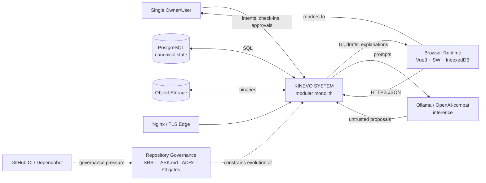

---

## 2. Interconnections

Relationship inventory (source → destination, type, payload, direction, sync/async, coupling):

| # | Source | Destination | Type | Crosses with | Sync? | Coupling | Evidence |
|---|---|---|---|---|---|---|---|
| R1 | Controllers (`Http/Controllers/Api`) | Application use cases | function call | validated DTO/request data | synchronous | medium-high (controllers thin, per-module) | e.g., `ScheduleDraftController` → `ApplyScheduleDraftUseCase` (FACT) |
| R2 | Application use cases | Domain services/entities | function call | domain objects | synchronous | high (semantic dependency) | `RunEodDeadlineUseCase` → `EndOfDayReconciliationService` (FACT) |
| R3 | Application | Infrastructure repositories (via Domain contracts) | interface-mediated call | domain entities | synchronous | low-medium (contract inversion) | `EloquentHardLandscapeRepository implements HardLandscapeRepository` (FACT) |
| R4 | Infrastructure | PostgreSQL | SQL/Eloquent | rows ↔ domain entities mapping | synchronous | medium (schema-bound) | all `Infrastructure/*/Eloquent*` (FACT) |
| R5 | Client api modules | HTTP API | network request/response (fetch) | JSON payloads, Sanctum token | synchronous per call | medium (contract = OpenAPI) | `resources/js/api`, `routes/api.php` (FACT) |
| R6 | Service worker | Browser caches | event-driven fetch interception | shell assets only; **never business API** | async (SW lifecycle) | very low by design | `sw-core.ts` docstring: "never intercepts business API calls" (FACT) |
| R7 | Mutation queue (client) | HTTP API | queued replay | operation UUID envelopes | asynchronous (retry loop) | low-medium | `offline/queue.ts` (FACT) |
| R8 | Scheduler pipeline components | each other | sequential composition | DraftInput→slots→constraints→ranking→draft | synchronous within a run | high internal, isolated externally | `ScheduleDraftGenerator::generate()` composition (FACT) |
| R9 | Adaptive check-ins | Ranking soft signals / boost gating | data influence | energy/stress observations → context-fit scores | delayed (next draft/boost decision) | indirect | `ContextFitComponent`, `BurnoutSignalDetector` (FACT) |
| R10 | AI provider adapters | External inference services | HTTP | prompts / structured JSON | synchronous w/ timeout (30s default) | low (provider abstraction + fallbacks) | `OllamaProvider` (FACT) |
| R11 | CanvasHost (Vue) | React island → Excalidraw | embedding/control | serialized drawing elements | synchronous in-page | bounded by adapter | `canvas/CanvasHost.vue`; architecture.md Canvas boundary (FACT) |
| R12 | EditorHost (Vue) | Tiptap | embedding/control | document model | synchronous in-page | bounded by adapter | `editor/EditorHost.vue` (FACT) |
| R13 | Console commands | Application use cases | scheduled invocation | time trigger (23:59 EOD) | asynchronous (cron) | low | `EodReconcileCommand`, `BreakEndNotificationCommand` (FACT) |
| R14 | Governance docs | All development activity | meta-control | requirement IDs FR-xx/NFR traceability | n/a (process-time) | very high over humans+agents | AGENTS.md hierarchy, TASK.md board (FACT) |
| R15 | Migrations (root `database/migrations`) | Schema | versioned DDL | table definitions incl. FTS vector on notes | build/migrate time | high (schema is shared resource) | `2026_08_18_000001_add_notes_search_vector.php` (FACT) |

### Connectivity Map (major flows only)

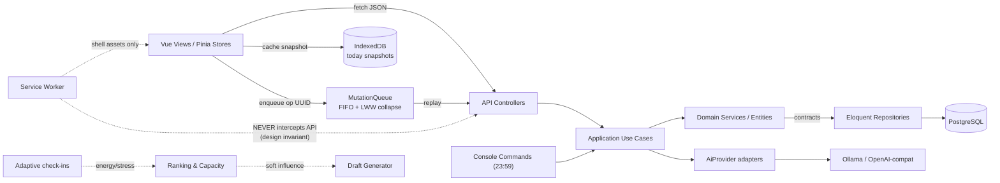

Key observation (**INFERENCE**): coupling is deliberately asymmetric — strong *downward* semantic dependency (Controller→UseCase→Domain) and weak *upward* dependency inversion through contracts at the infrastructure seam. The weakest couplings in the entire system are exactly the ones the governance documents declare as boundaries (SW↔API non-interception, AI advisory-only, editor/canvas ownership).

---

## 3. Synthesis

Capabilities that exist only through component interaction:

### Capability C-A: Deterministic schedule drafting
- **Contributing components:** `ScheduleQueryService` (snapshot assembly) → `SlotCalculator` → `Sacred Anchor` placement → `HardConstraintEngine` (8 rules) → `TaskRankingEngine` (9 components) → greedy assignment → `SchedulerExplainer` → persisted draft + `scheduler_runs` record.
- **Interaction mechanism:** pure-function pipeline over a persisted snapshot; same inputs → same draft (docstring FACT).
- **Resulting behavior:** explainable, reproducible weekly/daily drafts; violations enumerated before scoring ("Changes to soft scoring can never make an invalid candidate executable" — HardConstraintEngine docstring, FACT).
- **Smallest set:** SlotCalculator + HardConstraintEngine + TaskRankingEngine + generator.
- **Confidence:** High.

### Capability C-B: Offline-first execution with server convergence
- **Contributing:** SW shell precache + IndexedDB today snapshots + `MutationQueue` (op UUIDs, FIFO, LWW collapse for unversioned ops, retryable/permanent classification) + server-side idempotent/state-machine-guarded mutations + optimistic versioning.
- **Interaction mechanism:** persist-before-report locally; later replay; server rejects stale versions with stable 409; client refetches.
- **Resulting behavior:** user can plan/execute offline; system converges without silent loss or divergence.
- **Evidence:** `queue.ts` responsibilities block; `ApplyScheduleDraftUseCase` version conflict; TaskStatus transitions reject invalid replays. (FACT)
- **Confidence:** High.

### Capability C-C: Capacity-aware workload self-regulation
- **Contributing:** completion/partial/missed history → `CapacityCalculator`/`EffectiveCapacity` → daily ceiling inside generator → placement limits; plus context check-ins → `ContextFitScorer` → ranking; `BurnoutSignalDetector` → boost suppression.
- **Interaction mechanism:** closed loop across days (delayed feedback), mediated by persisted observations.
- **Resulting behavior:** the amount of work offered converges toward demonstrated capacity instead of a static estimate.
- **Confidence:** Medium-High (loop wiring verified in code; real dynamics UNKNOWN — single-user product, no production telemetry in repo).

### Capability C-D: Governed AI assistance (human-in-the-loop mutation gate)
- **Contributing:** `GenerateValidatedProposalUseCase` → schema validation → domain validation → proposal persisted (`ai_audit_tables`) → user accept/reject endpoints → transactional apply → activity log.
- **Interaction mechanism:** untrusted output forced through two validation layers + explicit human decision before any material mutation.
- **Resulting behavior:** AI can propose decomposition/notes/canvas changes but cannot mutate state autonomously.
- **Evidence:** Accept/Reject use cases; AGENTS.md AI rule; ai-architecture.md. (FACT)
- **Confidence:** High.

### Capability C-E: End-of-day truth reconciliation
- **Contributing:** clock → `EodReconcileCommand` (23:59) → `RunEodDeadlineUseCase` → `EndOfDayReconciliationService.reconcileAtDeadline` → missed marking → next-morning recovery paths (`/recovery`).
- **Interaction mechanism:** time-triggered idempotent sweep over eligible tasks.
- **Resulting behavior:** backlog rot is surfaced daily rather than silently aging; retry after crash finds nothing eligible (idempotency FACT in docstring).
- **Confidence:** High.

### Capability C-F: Long-horizon ↔ daily-execution coherence chain
- **Contributing:** Goals → Milestones (ordering, status) → Programs → Tasks (context FKs) → derived/manual progress → analytics rollups.
- **Interaction mechanism:** referential context + derived progress recomputation + milestone/goal urgency fed back into ranking components (`MilestoneUrgencyComponent`, `GoalDeadlineComponent`).
- **Resulting behavior:** finishing a small task can change global ranking pressure through urgency propagation — individually simple writes collectively produce prioritization behavior.
- **Confidence:** High (components FACT; propagation strength Medium).

### Synthesis diagram

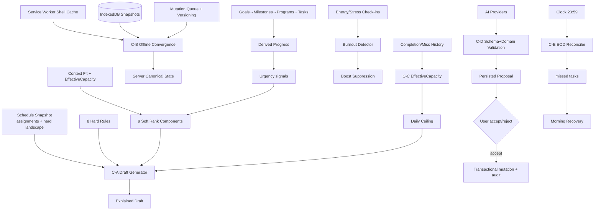

---

## 4. Emergence

### E1: Reproducibility of plans (determinism as a system property)
- **Contributing:** pure pipeline components + snapshot inputs + persisted run records.
- **Mechanism:** no hidden ambient state enters generation; randomness absent; ordering stable.
- **Consequence:** identical requests regenerate byte-identical drafts; failures are debuggable by re-running a snapshot; trust in proposals becomes testable.
- **Valence:** Positive. **Evidence:** generator docstring + component purity (FACT); absence of RNG in Domain/Scheduling (verified by inspection). **Confidence:** High.

### E2: Data-loss resistance under connectivity loss
No single component "implements durability"; it emerges from four independent policies interacting:
persist-before-report (queue), operation UUIDs (idempotency), server state machines (reject invalid replays), and canonical-server doctrine (IndexedDB disposable). Removing *any one* visibly degrades the property.
- **Valence:** Positive (by design intent). **Consequence:** complexity concentrates in conflict semantics rather than in any module. **Evidence:** queue.ts + use-case idempotency comments (FACT). **Confidence:** High (mechanism), Medium (real-world behavior untested here).

### E3: Timer integrity independent of client lifetime
Elapsed execution time is always computed from persisted timestamps (`startedAt`, `lastResumedAt`, `accumulatedSeconds`), never trusted from the browser.
- **Emergent property:** refreshing, crashing, or closing the browser cannot lose or corrupt a running session.
- **Valence:** Positive. **Evidence:** `ExecutionSession` docstring (FACT). **Confidence:** High.

### E4: Workload homeostasis (balancing macro-behavior)
Ceilings, safety reserves, capacity caps (`CAPACITY_CAP` reason), and burnout suppression together produce a system-level tendency: offered load tracks demonstrated capacity.
- **Valence:** Positive intended; **Negative risk** if signals are gamed/noisy (user could starve their own backlog by under-reporting — HYPOTHESIS).
- **Confidence:** Medium.

### E5: Documentation-as-control-loop over the codebase
The repo's own governance (normative hierarchy, pre-commit protocol, TASK.md gates, migration/API sync rules) makes *evolution itself* an emergent controlled process: agents/humans cannot land changes without tests/typecheck/build/docs synchronization. The system reproduces its own invariants across contributors.
- **Valence:** Positive for stability; Negative for velocity (heavier process; TASK.md alone is 312 KB). **Evidence:** AGENTS.md, Makefile gates, commit messages referencing TASK IDs (FACT). **Confidence:** High.

### E6: Contradiction between declared and actual presentation framework (flagged)
Docs (SRS Document Control, architecture.md) declare **Inertia.js** as the frontend glue; the code contains **no Inertia dependency and no usage** — `app.js` mounts `AuthHost` directly with Vue + Pinia, and pages communicate via plain fetch APIs (`resources/js/api`). React 19 exists solely to host the Excalidraw island.
- **Type:** emergent documentation-code drift. **Valence:** Negative (misleads newcomers and AI agents; violates the repo's own doc-sync rules). **Preserved contradiction:** SRS says Inertia; package.json/code say otherwise. **Confidence:** High that the discrepancy exists; UNKNOWN which is "intended."

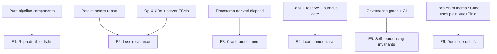

---

## 5. Feedback Loops

### Loop L1 — Effective Capacity balancing loop (−)
- **Participants:** completed/partial/missed executions → CapacityCalculator → EffectiveCapacity → daily ceiling → draft placements → future executions.
- **Initiating event:** task completion state changes.
- **Propagation:** persisted history → next draft generation (delay: hours–days).
- **Classification:** Balancing — more completions raise offered capacity, chronic misses shrink it; output counteracts drift between plan and reality.
- **Delay:** significant (one scheduling cycle minimum).
- **Evidence:** `EffectiveCapacity`, `CapacityCalculator`, `dailyCeiling()`, `CAPACITY_CAP` reason (FACT of wiring; dynamic behavior INFERENCE).

### Loop L2 — Burnout suppression balancing loop (−)
- Check-ins (stress ≥7 avg ∧ energy ≤4 avg over ≥3 samples) → `BurnoutSignal` → aggressive boosts suppressed → load decreases → stress trend falls.
- **Delay:** requires ≥3 samples (explicit MIN_SAMPLES). **Evidence:** `BurnoutSignalDetector` thresholds (FACT).
- Note the designed asymmetry: sparse data never triggers (fail-open to normal operation).

### Loop L3 — Version-conflict error/recovery loop (−)
- Stale draft apply → `ScheduleVersionConflict` → HTTP 409 → client refetches current schedule → regenerates/applies fresh → versions converge monotonically.
- **Classification:** Balancing; prevents divergence between concurrent editors/offline queue. **Evidence:** ApplyScheduleDraftUseCase lines 18–22 (FACT).

### Loop L4 — Offline queue retry loop (−, error recovery)
- Applier failure → `failed_retryable` → backoff replay → success (state `idle`) or permanent classification (`failed_permanent`, surfaced to user via `SyncStatusPanel`).
- **Risk variant:** if failure classification is wrong, retries could storm; mitigation = permanent-failure terminal state (FACT of design).

### Loop L5 — Human-in-the-loop AI gate (−, control gate)
- Intent → AI proposal → validation → human decision → apply/reject.
- **Balancing** in the control-theory sense: the human decision caps how much AI influence can enter state. **UNKNOWN/HYPOTHESIS:** there is **no automatic learning loop** from rejections back into prompt/provider selection visible in code (rejections are recorded, but no consumer of rejection statistics was found — verification needed).

### Loop L6 — Daily reconciliation cycle (− against backlog decay)
- Day end → missed marking → morning recovery offer → reschedule into new capacity.
- Prevents silent accumulation of stale "scheduled" items.

### Loop L7 — Progress→urgency→ranking reinforcing potential (+/unclear)
- Completing milestone-linked tasks advances milestone progress → raises urgency of remaining siblings → they rank higher sooner.
- Sign depends on user behavior; classified **Unclear** (repository proves wiring, not net effect).

### Loop L8 — Governance meta-loop (−, process-level)
- CI/test/doc gates reject non-conforming changes → contributors fix → repo invariants hold → gates stay credible. Human-institutional loop, delay = PR cycle. (FACT of mechanism.)

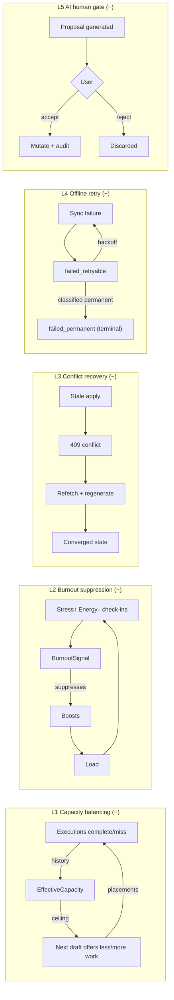

---

## 6. Causality

### Chain CA-1: Completion → Global reprioritization (intended core value loop)
- **Trigger:** user completes/subtasks-toggle/partial-completes a task.
- **Direct cause:** progress events written; task status transition (validated).
- **Intermediate causes:** derived progress recomputation up goal/milestone graph → milestone/goal urgency components re-score → next draft/ranking shifts.
- **Contributing conditions:** task linked to program/goal/milestone; progress mode `derived`.
- **Consequence:** system attention flows to lagging long-horizon outcomes automatically.
- **Intended causality:** yes (SRS priority ladder puts goal/milestone feasibility above ordinary backlog).
- **Observed deviation risk:** manual vs derived progress modes can diverge if mixed (HYPOTHESIS; no evidence of reconciliation logic inspected).
- **Confidence:** Medium-High.

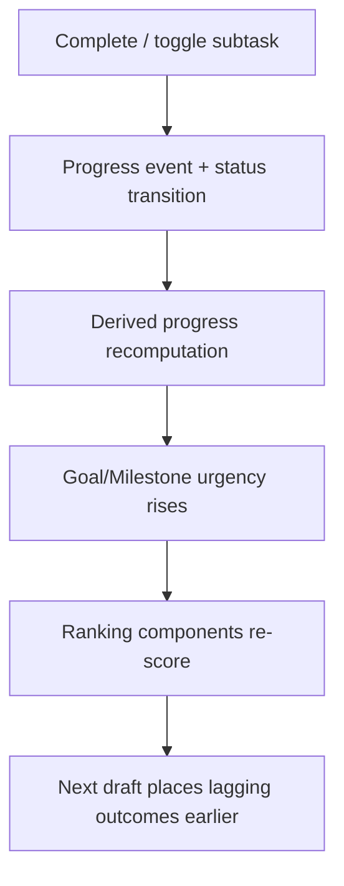

### Chain CA-2: Deadline miss → Truth surfacing → Recovery
- **Trigger:** clock reaches 23:59 with unresponsive eligible tasks.
- **Direct cause:** EOD reconcile marks them `missed`.
- **Intermediates:** morning recovery endpoint proposes recovery; `missed → completed` legal transition (FR-48).
- **Constraint:** idempotency — reruns find nothing eligible.
- **Consequence:** history stays truthful; guilt-free re-planning path exists.
- **Failure propagation if broken:** if cron doesn't fire, tasks silently stay `scheduled` → capacity math polluted → drafts overcommit (HYPOTHESIS; depends on whether queries filter stale assignments — verification needed).
- **Confidence:** High (marking), Medium (downstream pollution claim).

### Chain CA-3: Offline write → Convergence or explicit conflict
- **Trigger:** mutation while disconnected.
- **Direct cause:** envelope persisted locally with op UUID; UI reports success locally.
- **Intermediates:** FIFO replay; LWW collapse for safe unversioned ops; server validates state machine + version.
- **Outcomes:** applied (canonical updated), 409 conflict (refetch), permanent failure (user-visible), or retryable (loop L4).
- **Side effect:** today snapshot cache may be stale until refetch — mitigated because IndexedDB is declared non-canonical.
- **Confidence:** High.

### Chain CA-4: AI suggestion → Guarded mutation
- **Trigger:** user requests breakdown/summarize/extract/suggest-canvas.
- **Direct cause:** prompt built with JSON shape → provider call (30s timeout default; journey budget noted 300s in commits).
- **Intermediates:** response → schema validation → domain validation → proposal row (audit).
- **Gate:** explicit accept required → transactional apply → activity log.
- **Intended vs observed gap:** NONE structurally — this is the chain where design and code align most tightly. Residual risk: provider latency blocks UX synchronously (observed: dedicated smoke/journey tests needed 300s budget — INFERENCE from commit 09f88d8).
- **Confidence:** High.

### Chain CA-5: Concurrent edit → Monotonic convergence
- **Trigger:** two writers target same aggregate (e.g., schedule apply, note edit with baseVersion).
- **Direct cause:** version comparison at persistence boundary.
- **Outcome:** loser receives stable 409; no silent overwrite (AGENTS.md concurrency rule enforced in controllers list showing 409 usage).
- **Confidence:** High.

### Intended vs Observed gaps (flagged)
1. **Inertia declaration vs plain-Vue reality** (see E6). Docs intend Inertia-based navigation; observed code uses direct mounting + fetch. GAP.
2. **PostgreSQL production vs SQLite :memory: test suite** (`composer test` sets DB_CONNECTION=sqlite). Temporal arithmetic, FTS (`notes_search_vector`), and JSON behaviors may differ between engines. Design intends PostgreSQL fidelity; tests actually certify SQLite behavior. GAP (systemic risk R-01 below).
3. **PHP version note drift** — composer requires `^8.4`; TASK-001 note says "PHP 8.5". Minor documentation inconsistency (FACT of discrepancy).

---

## 7. System Hierarchy

Observed abstraction levels (derived, not assumed):

| Level | Purpose | Boundary | Dominant interactions |
|---|---|---|---|
| **L0 Product/Governance** | Define what must exist and why | SRS/ADRs/OpenAPI vs everything else | constrains all lower levels |
| **L1 Deployable System** | One runnable unit serving UI+API | container edge (Nginx→app) | HTTPS in, SQL/AI/storage out |
| **L2 Subsystems** | Client SPA · API+Domain monolith · Persistence · Offline client stack · AI boundary | module directories | contract-mediated |
| **L3 Bounded Contexts** | ~20 domain modules | namespace + repository contracts per context | use-case orchestration |
| **L4 Components** | Use cases, domain services, engines, repositories, stores, queues | class/file level | calls, interfaces |
| **L5 Mechanisms** | Value objects, state machines, rules/components (constraint rule, rank component) | pure functions/classes | composition |

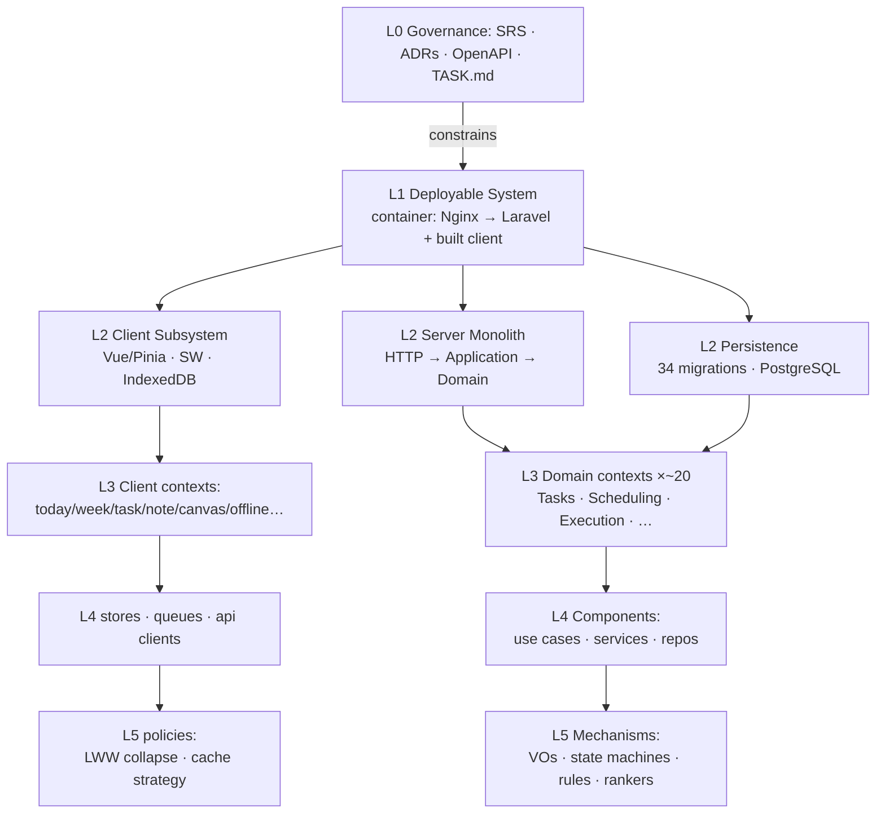

---

## 8. State and Transitions

### SM-1: Task lifecycle (`TaskStatus`, explicit transition table)
- **States:** backlog, scheduled, in_progress, partial, continued, completed, skipped, missed, conflict.
- **Triggers:** user actions + EOD reconcile + recovery.
- **Terminals:** completed, skipped (empty transition lists — enforced).
- **Risky transitions:** `conflict` reachable from scheduled/in_progress — recovery paths defined back to scheduled/in_progress/backlog; `missed → completed` intentionally allowed (FR-48) — a recovered task bypasses re-execution tracking (design choice worth watching).
- **Recovery:** EOD + morning recovery flow.
- Evidence: `TaskStatus.php` TRANSITIONS map (FACT).

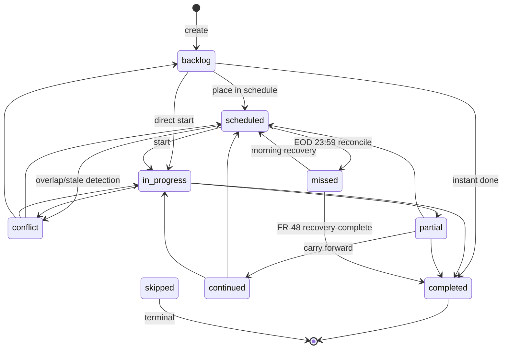

### SM-2: Execution timer (`ExecutionStatus`)
- running ⇄ paused; both → completed | abandoned; terminals have no exits.
- Elapsed always derived from timestamps; invalid transitions throw (`assertTransition`).
- Evidence: `ExecutionStatus.php` + `ExecutionSession` (FACT).

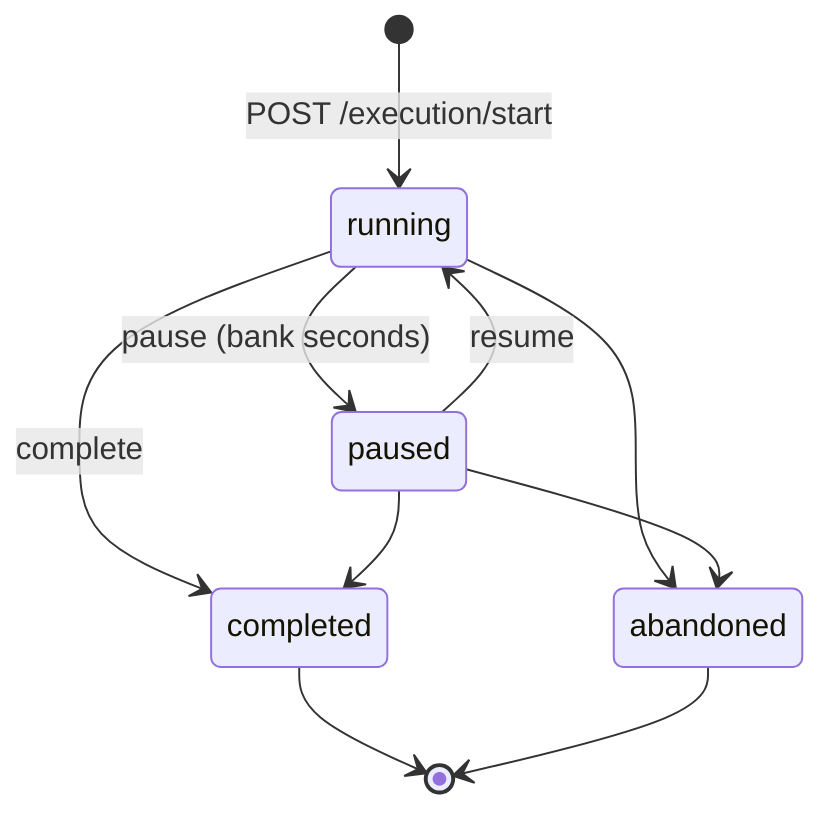

### SM-3: Offline mutation queue (`MutationQueueState`)
- idle → queued → syncing → idle | conflict | failed_retryable → syncing | failed_permanent (terminal).
- Recovery: user visibility via `SyncStatusPanel`; versioned ops never collapsed.
- Evidence: `queue.ts` type + docstring (FACT).

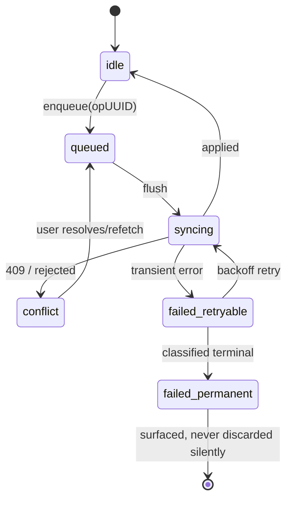

### SM-4: Recharge/Focus/Break sessions
Same pattern family as SM-2 (start/pause/resume/complete/abandon routes exist for recharge; break has begin/end; boost has setup/start/end). Modeled identically — INFERENCE from route symmetry + shared use-case style; per-entity transition tables not individually read this pass (confidence Medium).

### SM-5: Schedule draft lifecycle
generated (pure, unpersisted) → persisted draft/run record → applied (bumps schedule version) OR discarded; stale apply → 409. Generating never mutates (docstring FACT).

---

## 9. System Map

### A. Context Map — boundary & externals
*(purpose: who/what touches the system)* — see Section 1 diagram. Distinct purpose there; not repeated.

### B. Structural Map — internal subsystems

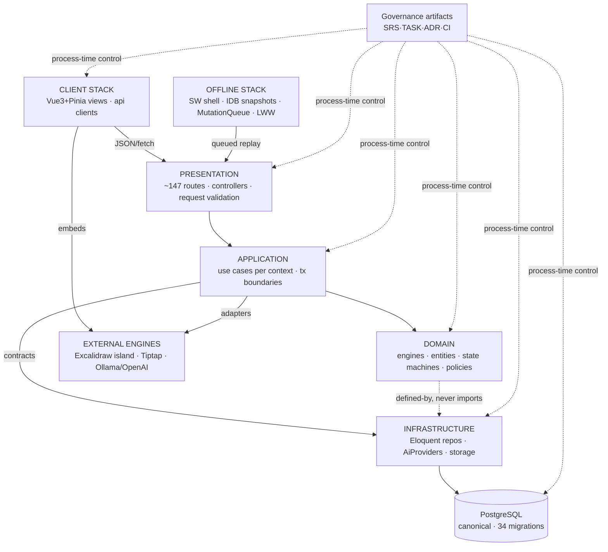

### C. Dynamic/Runtime Map — the canonical "plan → execute → learn" day cycle

```mermaid
sequenceDiagram
    participant U as User
    participant V as Vue Views/Stores
    participant Q as MutationQueue(IDB)
    participant A as API/UseCases
    participant D as Domain Engines
    participant P as PostgreSQL

    U->>V: capture task / set anchor
    V->>Q: enqueue(opUUID) [if offline] 
    Q-->>V: local success (persisted first)
    Q->>A: replay when online
    A->>D: validate state machine + constraints
    D->>P: persist (version bump)
    A-->>Q: ack / 409 / permanent-fail
    U->>V: request weekly draft
    V->>A: POST /schedule/draft
    A->>D: snapshot → slots → hard rules → ranking → greedy
    D-->>A: explained draft (no mutation)
    U->>V: apply draft
    V->>A: draft/apply + baseVersion
    A->>P: assignments @version+1 (else 409)
    Note over U,P: during day: execution timers (timestamp-derived)
    Note over A,P: 23:59 EOD reconcile → missed; morning recovery
    A->>D: EffectiveCapacity recalculation feeds next draft ceiling
```

### D. Causal/Feedback Map — dominant loops overlaid

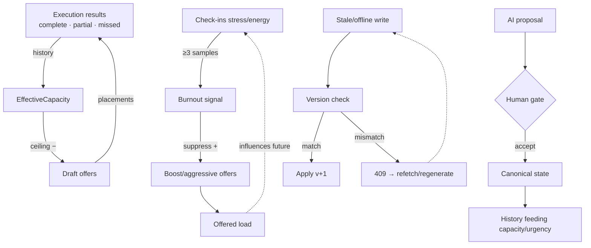

---

## 10. Bottlenecks and Constraints

### Bottlenecks
| Location | Mechanism | Impact | Confidence |
|---|---|---|---|
| PostgreSQL single instance | every capability reads/writes canonical state; no replica/read-path split in repo | total-system throughput ceiling; availability SPOF | High (structure), Medium (load profile unknown) |
| Synchronous AI provider calls inside request path | 30s default timeout; journeys budgeted 300s in practice | UX stalls on slow local models | Medium-High (code + commit evidence) |
| Serialized scheduler runs (run locks + `scheduler_runs`) | intentional determinism guard | draft throughput limited; fine for single-user, would block multi-user growth | High (intent), Low (stress data UNKNOWN) |
| Single app container (dev/prod compose) | no horizontal redundancy | restart = full outage window | High (compose FACT) |
| Root `database/migrations` loading via AppServiceProvider | custom loader path deviates from framework default | subtle bootstrap-order fragility; tooling assumptions | Medium (TASK-001 note) |

### Constraints (hard rules limiting behavior space)
1. **Precedence ladder (SRS §0.3)** — automation may never resolve lower rule by violating higher (legal/security → temporal → hard landscape → locked → anchor → deadline → tier → capacity → soft signals → backlog). This *is* the product's constitution. (FACT)
2. **Deterministic scheduling rule** — same inputs ⇒ same draft. (FACT)
3. **Server-canonical doctrine** — IndexedDB never authoritative. (FACT)
4. **Domain purity rule** — Domain must not import presentation/vendors. (FACT, docstring+AGENTS)
5. **Human-gate on AI mutations.** (FACT)
6. **Single-user assumption** — simplifies authorization everywhere (owner-scoped queries), forbids collaboration features. (FACT)
7. **Test-env constraint** — SQLite in-memory for suite speed; bounds which Postgres-specific features can be safely used (fts vector exists — tension flagged). (FACT of config)

### Single Points of Failure
- PostgreSQL (data + queue + cache tables).
- The one Laravel app process/container.
- `AppServiceProvider` migration loading (bootstrap-critical customization).
- Local disk volumes for pgdata/ollama unless backup discipline (`make prod-backup`) followed.

### Coupling Hotspots
- **Task aggregate** — referenced by Scheduling, Execution, Recovery, Analytics, Imports, AI extraction, QuickCapture; any Task semantic change ripples widest. (INFERENCE from cross-module imports of `Domain\Tasks`)
- **Application layer** — every controller depends on it; it's the mandatory middle.
- **OpenAPI contract** — client api modules + server controllers + docs triple-sync obligation.

---

## 11. Leverage Points

Prioritized qualitatively by Impact × Reach × Changeability (criteria: Impact = behavioral leverage per line changed; Reach = number of capabilities touched; Changeability = how guarded/localized the change is):

| # | Leverage point | Why disproportionate | Guard rails already present |
|---|---|---|---|
| 1 | **`HardConstraintEngine.default()` rule list & order** | encodes precedence ladder items 2–8; adding/removing one rule reshapes every draft | pure functions, dedicated rule tests (FACT) |
| 2 | **Soft ranking components registry** (9 components + weights) | tunes daily felt behavior of the whole planner without touching correctness | component-per-file isolation, ranking tests |
| 3 | **EffectiveCapacity/CapacityCalculator parameters** | single knob controlling system-wide offered load (loop L1 gain) | value objects + calculator tests |
| 4 | **`MutationQueue` collapse policy flag** (`collapseLastWriteWins`) | trades bandwidth vs data granularity globally for offline ops | injectable policy, unit-tested |
| 5 | **EOD command schedule + eligibility predicate** | defines the system's definition of "a day honestly ended" | idempotency by construction |
| 6 | **`BurnoutSignalDetector` thresholds** | gates the anti-overcommit safety valve | constants exposed, deterministic tests |
| 7 | **OpenAPI + migration sync discipline** | keeps the tri-part contract coherent; breaking it silently breaks offline clients | Makefile `check-openapi`, CI gates |
| 8 | **`AppServiceProvider` migration path override** | small bootstrap detail; breaking it bricks setup for every self-hoster | validate scripts |

Deliberately NOT listed: frontend styling/theme tokens (high churn, low systemic leverage), individual CRUD use cases (replaceable).

---

## 12. Systemic Risks

| Risk | Cause | Propagation | Impact | Detection | Mitigation |
|---|---|---|---|---|---|
| **R-01 Test/prod DB dialect divergence** | suite pins SQLite :memory:; prod is PostgreSQL (FACT) | features passing tests fail on real temporal/FTS/JSON semantics; false confidence ships | data corruption-class bugs in dates/search reaching users | add a Postgres-backed CI job or testcontainers; audit FTS + Carbon-interval queries | currently none structural |
| **R-02 Doc-code drift (Inertia)** | docs updated without code sync (or vice versa) | newcomers/agents implement against phantom framework; violates repo's own sync rules | wasted effort; governance credibility erosion | grep checks / doc linter | fix one side deliberately via ADR |
| **R-03 Cron dependence for truth (EOD)** | reconcile runs only if scheduler fires | missed sweeps leave stale `scheduled` → capacity overestimates → overcommitted drafts (chain CA-2) | quiet planning quality decay | observability endpoints exist (`/metrics`, `/observability/runs`) — verify EOD heartbeat monitoring | alerting not evidenced in-repo (UNKNOWN) |
| **R-04 Retry amplification** | retryable classification too broad | queue hammers API after incidents (mini retry-storm) | server load spike post-outage | sync-status panel shows state | permanent-failure classifier + FIFO order (partial, by design) |
| **R-05 Single-user auth blast radius** | one owner account, token-based | leaked Sanctum token exposes 100% of personal knowledge base (notes/canvas/AI logs) | maximal privacy impact | SECURITY.md disclosure path | rotation procedures not evidenced (UNKNOWN) |
| **R-06 Feedback mis-specification (gamed signals)** | capacity/burnout driven by self-reported inputs | user under-reports → system starves backlog (loop L1/L2 miscalibrated) | productivity harm opposite of intent | analytics surfaces trends | thresholds conservative; sparse-data fail-open (present) |
| **R-07 Third-party engine upgrade churn** | pinned Tiptap exact versions; Excalidraw override pinning (package.json overrides nanoid) | security patches require coordinated bumps across island boundary | maintenance drag; known-CVE exposure window | Dependabot active (merge commits FACT) | pinning itself is the current mitigation |
| **R-08 Governance weight** | 312KB TASK.md + multi-gate pre-commit protocol | contributor friction; agent context overflow → shortcuts/silent drift | slower iteration; process bypass temptation | repo hygiene scripts (`validate`, `check-links`) | deliberate trade-off, documented |
| **R-09 State divergence windows** | IDB snapshots + queue in flight during conflict | brief UI/server disagreement | confusion, duplicate entries if user re-enters manually | conflict states surfaced in SyncStatusPanel | server-side dedupe via op UUID (present) |

---

## 13. System-Level Insights

1. **Simplest accurate description:** *A single-user, server-authoritative planning-and-execution system whose core trick is converting honest execution history into tomorrow's constrained, explained, capacity-respecting plan — with offline patience and human-gated AI.*
2. **Major subsystems:** client stack (SPA+offline), HTTP/application/domain monolith, persistence, external-engine adapters (editor/canvas/AI), and a fifth often-missed one: **the governance subsystem** that regulates the system's own evolution.
3. **Strongest interconnections:** Controller→UseCase→Domain call chain (everything), and Task-aggregate fan-out across six+ contexts.
4. **Emergent capabilities:** reproducible plans; crash-proof timers; offline loss-resistance; workload homeostasis — none owned by a single module.
5. **Feedback loops:** five engineered loops (capacity, burnout, conflict-recovery, retry, human-AI gate) + one institutional loop (governance). All balancing except possibly L7 (progress→urgency, sign unclear).
6. **Most important causal chains:** completion→urgency→redistribution (CA-1) and deadline-miss→truth→recovery (CA-2) — together they define the product's learning character.
7. **Major bottlenecks:** PostgreSQL (structural), synchronous AI latency (experiential), serialized scheduler runs (deliberate).
8. **Major leverage points:** hard-rule list, ranking registry, capacity parameters, queue collapse policy — all small, guarded, central.
9. **Predictable from architecture:** determinism, conflict stability (409s), terminal-state safety, offline convergence mechanics.
10. **Emergent/unpredictable:** real-loop calibration (does homeostasis feel right?), SQLite-vs-Postgres behavioral deltas, human adherence effects.
11. **Load-bearing assumptions:** one user; honest self-reporting; cron fires; server clock trustworthy; browsers support SW+IDB.
12. **Most fragile:** the three seams where declared intent and implementation diverge (Inertia claim, DB dialect, migration loader) — fragility lives in *contracts*, not algorithms.
13. **Most resilient:** the scheduling core and execution timers — pure, timestamp-derived, exhaustively tested, zero ambient dependencies.
14. **Complexity concentration:** conflict semantics (offline×versions×state machines) and the governance apparatus — both are where the system pays for its guarantees.

---

## 14. Evidence Matrix

| Finding | Type | Evidence | Confidence | Verification Needed |
|---|---|---|---|---|
| Modular monolith, layered Presentation/Application/Domain/Infrastructure | Fact | `docs/architecture.md` + `server/app/*` tree | High | — |
| ~147 API routes across ~20 domains | Fact | `server/routes/api.php` count | High | route-by-route coverage audit |
| Deterministic draft pipeline; hard rules precede scoring | Fact | `ScheduleDraftGenerator`, `HardConstraintEngine` docstrings/code | High | property-based test for determinism |
| 8 hard rules / 9 ranking components | Fact | `Rules/`, `Components/` listings | High | — |
| Optimistic versioning → stable 409 | Fact | `ApplyScheduleDraftUseCase`, controllers | High | integration test matrix for conflicts |
| Task & Execution explicit FSMs with enforced tables | Fact | `TaskStatus`, `ExecutionStatus` TRANSITIONS | High | exhaustive transition tests existence check |
| EOD 23:59 idempotent missed-marking | Fact | `RunEodDeadlineUseCase`, `EodReconcileCommand` | High | confirm cron registration (schedule:run wiring not read) |
| SW caches shell only, never API | Fact | `sw-core.ts` docstring + fetch predicate | High | e2e assertion in `browser-e2e.md` baseline |
| Offline queue: opUUID, FIFO, LWW-collapse, retry/permanent states | Fact | `offline/queue.ts` | High | chaos test of applier failure injection |
| AI proposals gated by human accept/reject + audit tables | Fact | `Application/Ai/*`, `create_ai_audit_tables` migration | High | negative test: no mutation path bypassing gate |
| Burnout detector thresholds suppress boosts | Fact | `BurnoutSignalDetector` constants | High | downstream consumption point (boost use case) trace |
| EffectiveCapacity feeds draft ceilings (loop L1) | Inference | `dailyCeiling()` + CapacityCalculator usage | Medium-High | trace exact data source of capacity samples |
| Production runs PostgreSQL 17 via compose | Fact | `infrastructure/docker-compose*.yml` | High | — |
| Tests execute on SQLite :memory:, not Postgres | Fact | `composer.json` test script env vars | High | dialect-sensitive query audit (FTS, intervals) |
| Frontend does NOT use Inertia despite docs claiming it | Fact (of discrepancy) | `package.json` deps + `app.js` + zero inertia imports | High | decide correction direction via ADR |
| React present solely as Excalidraw island runtime | Inference | react deps + `CanvasHost.vue` island pattern | Medium-High | confirm no other React usage |
| Migrations loaded from repo-root via AppServiceProvider | Fact | TASK-001 notes + root dir layout | Medium-High | read `app/Providers/AppServiceProvider.php` directly |
| Object storage adapter wired for attachments/canvas files | Inference | attachments routes + architecture storage model | Medium | locate concrete filesystem/S3 adapter config |
| No automatic learning from AI rejections | Hypothesis | absence found in Application/Ai listing | Low-Medium | search for consumers of rejection stats |
| Missed EOD sweeps degrade capacity estimates | Hypothesis | causal reasoning over CA-2 | Low-Medium | instrument: stale-`scheduled` query vs capacity input |
| Real-world loop calibration (homeostasis quality) | Unknown | — | — | longitudinal usage telemetry (out of repo scope) |
| Production secrets handling | Unknown | `make secrets` exists | — | operator interview |
| Email/external notification egress | Unknown | none found in deps | Medium (absence) | full config scan |

---

## 15. Mermaid Diagrams

All diagrams are embedded inline at their points of highest relevance (Sections 1, 2, 3, 4, 5, 6, 7, 8, 9) rather than duplicated here — each serves a distinct analytical purpose:

| Diagram | Section | Purpose |
|---|---|---|
| Boundary context flowchart | §1 | what crosses the system edge |
| Connectivity flowchart | §2 | relationship types & strengths |
| Capability synthesis flowchart | §3 | how components combine into C-A…C-F |
| Emergence flowchart | §4 | multi-component properties E1…E6 |
| Feedback loops flowcharts | §5 | L1–L5 with polarity labels |
| Causal chain graph | §6 | CA-1 completion→reprioritization |
| Hierarchy flowchart | §7 | L0…L5 abstraction levels |
| Three state diagrams | §8 | Task, Execution, MutationQueue FSMs |
| Structural map | §9B | internal subsystem topology |
| Runtime sequence diagram | §9C | day-cycle dynamics incl. offline replay |
| Causal/feedback overlay map | §9D | loops composited onto structure |

---

### Five Most Important System Insights

1. **The precedence ladder is the real kernel.** The SRS §0.3 ordering is physically encoded in the order of hard-constraint rules executed before any scoring (`HardConstraintEngine`). Changing that array changes the system's values; changing anything else mostly changes its style. It is simultaneously the strongest invariant and the highest-leverage edit surface.

2. **Reliability here is an interaction contract, not a component property.** Crash-proof timers, offline loss-resistance, and conflict stability emerge only from *pairs* of decisions (timestamp-derived state + server FSM; persist-before-report + op UUID + version checks). Reviewing any single file will systematically overestimate the system's robustness — guarantees live between files, protected by tests that span them.

3. **Every feedback loop is balancing by construction, and that is the product thesis.** Capacity ceilings shrink after misses, burnout suppresses boosts, conflicts force reconvergence, and the human gate caps AI influence. The system is architected to resist its own enthusiasm — the rarest design commitment in productivity software — and its main failure mode is therefore *under-offering*, not runaway automation.

4. **The most dangerous seams are documentary, not algorithmic.** The Inertia-vs-plain-Vue contradiction and the SQLite-test/PostgreSQL-prod dialect gap are invisible to the test suite precisely because the algorithms are clean. Contract drift — not logic bugs — is where this codebase's risk actually accumulates, and its own governance rules (doc-sync mandates) are the correct but not-yet-complete defense.

5. **Governance is a sixth subsystem with real runtime analogues.** CI gates, the pre-commit protocol, migration/API sync rules, and the TASK.md board form a control loop over the codebase's evolution with its own sensors (validate/check-links/check-openapi), actuators (blocking commits), and failure mode (drift, as observed in insight 4). Any future change to Kinevo should treat this loop's health — gate honesty, doc currency — as a first-class operational concern, equivalent to monitoring a production service.

---

*End of analysis. No repository files were modified; this report was written to `mapping.md` as requested.*
